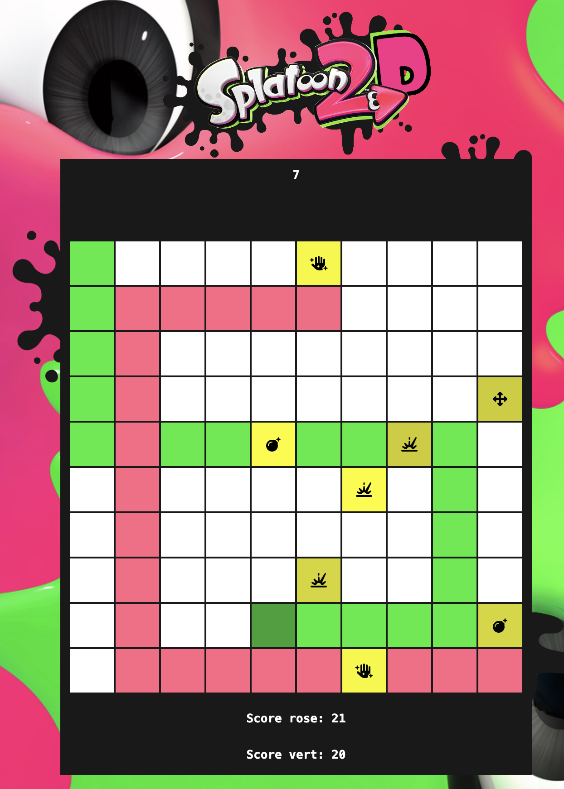

# Splatoon 2D

A tiny game like Splatoon, but in simpler.

Playable with two players.

## Controls:
- 1st player: arrow keys
- 2nd player: keys ZQSD

## Objective:
You have 30 seconds to color the more boxes than your opponent.

Power ups will appear on the grid.

Some will make you own more boxes.

Some other will make you lose your boxes.

**Try it [here](https://dimitrilahaye.github.io/splatoon-2d/)!**
